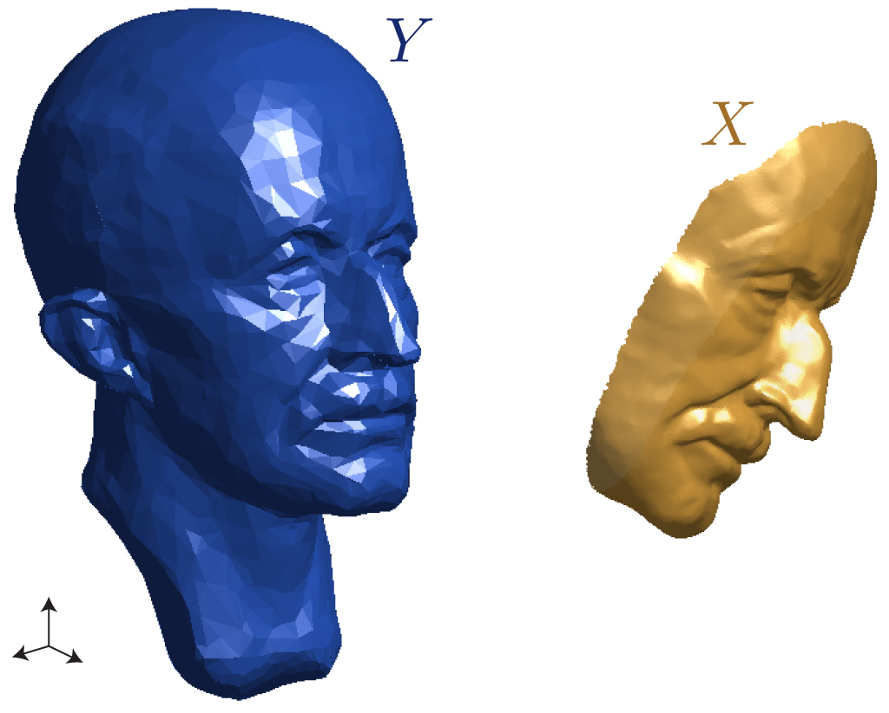
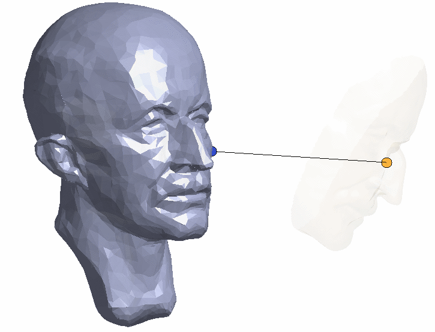
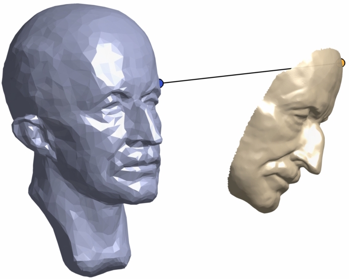

# Geometry Processing — Registration

> **To get started:** Clone this repository then issue
> 
>     git clone --recursive http://github.com/[username]/geometry-processing-registration.git
>

## Installation, Layout, and Compilation

See
[introduction](http://github.com/alecjacobson/geometry-processing-introduction).

## Execution

Once built, you can execute the assignment from inside the `build/` using 

    ./registration [path to mesh1.obj] [path to mesh2.obj]

## Background

In this assignment, we will be implementing a version of the [iterative closest
point (ICP)](https://en.wikipedia.org/wiki/Iterative_closest_point), not to be
confused with [Insane Clown Posse](https://en.wikipedia.org/wiki/Insane_Clown_Posse).

Rather than [registering multiple point
clouds](https://en.wikipedia.org/wiki/Point_set_registration), we will register
multiple triangle mesh surfaces. 

This _algorithm_ and its many [variants](papers/Effcient_Variants_of_ICP.pdf) has been used for quite some time to
align discrete shapes. One of the first descriptions is given in ["A Method for
Registration of 3-D Shapes" by Besl & McKay 1992](papers/method-for-registration-3d-shapes.pdf). However, the award-winning
PhD thesis of Sofien Bouaziz [("Realtime Face Tracking and Animation" 2015,
section 3.2-3.3)](https://lgg.epfl.ch/publications/2015/Sofien_Thesis/thesis.pdf) contains a more modern view that unifies many of the variants
with respect to how they impact the same core optimization problem. 

For our assignment, we will assume that we have a triangle mesh representing a
complete scan of the surface $Y$ of some [rigid
object](https://en.wikipedia.org/wiki/Rigid_body) and a new partial scan of
that surface $X$.



These meshes will not have the same number of vertices or the even the same
topology. We will first explore different ways to _measure_ how well aligned
two surfaces are and then how to optimize the _rigid_ alignment of the partial
surface $X$ to the complete surface $Y$.

## Hausdorff distance

We would like to compute a single scalar number that measures how poorly two
surfaces are matched. In other words, we would like to measure the _distance_
between two surfaces. Let's start by reviewing more familiar distances:

#### Point-to-point distance
The usually Euclidean distance between _two points_ $\mathbf{x}$ and $\mathbf{y}$ is the $L^{2}$
norm of their difference :

$$
d(\mathbf{x},\mathbf{y}) = || \mathbf{x} - \mathbf{y}|| .
$$


#### Point-to-projection distance

When we consider the distance between a point $\mathbf{x}$ and some _larger_ object $Y$ (a line,
a circle, a surface), the natural extension is to take the distance to the
closest point $\mathbf{y}$ on $Y$:

$$
d(\mathbf{x},Y) = \inf_{\mathbf{y} \in  Y} d(\mathbf{x},\mathbf{y}).
$$


written in this way the
[infimum](https://en.wikipedia.org/wiki/Infimum_and_supremum) considers all
possible points $\mathbf{y}$ and keeps the minimum distance. We may equivalently write
this distance instead as simply the point-to-point distance between $\mathbf{x}$ and
the _closest-point projection_ $P_Y(\mathbf{x})$:

$$
d(\mathbf{x},Y) = d((\mathbf{x},P_Y(\mathbf{x})) = || \mathbf{x} - P_Y(\mathbf{x})|| .
$$


If $Y$ is a smooth surface, this projection will also be an [orthogonal
projection](https://en.wikipedia.org/wiki/Projection_(linear_algebra)#Orthogonal_projections).




### Directed Hausdorff distance

We might be tempted to define the distance from surface $X$ to $Y$ as the
_infimum_ of _point-to-projection_ distances over all points $\mathbf{x}$ on $X$:

$$
D_\text{inf}(X,Y) = \inf_{\mathbf{x} \in  X} || \mathbf{x} - P_Y(\mathbf{x})|| ,
$$

but this will not be useful for registering two surfaces: it will measure zero
if even just a single point of $\mathbf{x}$ happens to lie on $Y$. Imagine the noses of
two faces touching at their tips.

Instead, we should take the _supremum_ of _point-to-projection_ distances over
all points $\mathbf{x}$ on $X$:

$$
D_{\overrightarrow{H}}(X,Y) = \sup_{\mathbf{x} \in  X} || \mathbf{x} - P_Y(\mathbf{x})|| .
$$


This surface-to-surface distance measure is called the _directed_ [Hausdorff
distance](https://en.wikipedia.org/wiki/Hausdorff_distance). We may interpret
this as taking the worst of the best: we 
let each point $\mathbf{x}$ on $X$ declare its shortest distance to $Y$ and then keep
the longest of those.



It is easy to verify that $D_{\overrightarrow{H}}$ will only equal zero if all
points on $X$ also lie exactly on $Y$. 

The converse is not true: if $D_{\overrightarrow{H}}=0$ there may still be
points on $Y$ that do not lie on $X$. In other words, _in general_ the directed
Hausdorff distance from surface $X$ to surface $Y$ will not equal the Hausdorff
distance from surface $Y$ to surface $X$:

$$
D_{\overrightarrow{H}}(X,Y) \ne  D_{\overrightarrow{H}}(Y,X).
$$


#### directed Hausdorff distance between triangle meshes

We can approximate a _lower bound_ on the Hausdorff distance between two meshes
by densely sampling surfaces $X$ and $Y$. We will discuss sampling methods,
later. For now consider that we have chosen a set $\mathbf{P}_X$ of $k$ points on $X$
(each point might lie at a vertex, along an edge, or inside a triangle). The
directed Hausdorff distance from $X$ to another triangle mesh $Y$ must be
_greater_ than the directed Hausdorff distance from this [point
cloud](https://en.wikipedia.org/wiki/Point_cloud) $\mathbf{P}_X$ to $Y$:

$$
D\_{\overrightarrow{H}}(X,Y) \ge  
D\_{\overrightarrow{H}}(\mathbf{P}\_X,Y) = \max\_{i=1}^k || \mathbf{p}\_i - P\_Y(\mathbf{p}\_i)|| ,
$$


where we should be careful to ensure that the projection $P_Y(\mathbf{p}_i)$ of the
point $\mathbf{p}_i$ onto the triangle mesh $Y$ might lie at a vertex, along an edge or
inside a triangle. 

As our sampling $\mathbf{P}_X$ becomes denser and denser on $X$ this lower bound will
approach the true directed Hausdorff distance. Unfortunately, an efficient
_upper bound_ is significantly more difficult to design.

#### Hausdorff distance for alignment optimization

Even if it _were_ cheap to compute, Hausdorff distance is difficult to
_optimize_ when aligning two surfaces. If we treat the Hausdorff distance
between surfaces $X$ and $Y$ as an energy to be minimized, then only change to
the surfaces that will decrease the energy will be moving the (in general)
isolated point on $X$ and isolated point on $Y$ generating the maximum-minimum
distance. In effect, the rest of the surface does not even matter or effect the
Hausdorff distance. This, or any type of $L^\infty$ norm, will be much more
difficult to optimize.

Hausdorff distance can serve as a validation measure, while we turn to $L^{2}$
norms for optimization.

## Integrated closest-point distance

We would like a distance measure between two surfaces that — like Hausdorff
distance — does not require a shared parameterization. Unlike Hausdorff
distance, we would like this distance to _diffuse_ the measurement over the
entire surfaces rather than generate it from the sole _worst offender_. We can
accomplish this by replacing the _supremum_ in the Hausdorff distance (
  $L^{\infty}$
  )
with a integral of squared distances (
  $L^2$
  ). Let us first define a directed
_closest-point distance_ from  a surface $X$ to another surface $Y$, as the
integral of the squared distance from every point $\mathbf{x}$ on $X$ to its
closest-point projection $P_Y(\mathbf{x})$ on the surfaces $Y$:

$$
D_{\overrightarrow{C}}(X,Y) = \sqrt{\ \int \limits_{\mathbf{x}\in X} || \mathbf{x} - P_Y(\mathbf{x}) || ^{2} \;dA }.
$$


This distance will only be zero if all points on $X$ also lie on $Y$, but when
it is non-zero it is summing/averaging/diffusing the distance measures of all
of the points.

This distance is suitable to define a matching energy, but is not necessarily
welcoming for optimization: the function inside the square is non-linear. Let's
dig into it a bit. We'll define a directed _matching energy_
$E_{\overrightarrow{C}}(Z,Y)$ from $Z$ to $Y$ to be the squared directed
closest point distance from $X$ to $Y$:

$$
E_{\overrightarrow{C}}(Z,Y) = \int \limits_{\mathbf{z}\in Z} || \mathbf{z} - P_Y(\mathbf{z}) || ^{2} \;dA =
\int \limits_{\mathbf{z}\in Z} || f_Y(\mathbf{z}) || ^{2} \;dA
$$


where we introduce the proximity function $\mathbf{f}_Y:\mathbb{R}^{3}\Rightarrow \mathbb{R}^{3}$ defined simply as the
vector from a point $\mathbf{z}$ to its closest-point projection onto $Y$:

$$
\mathbf{f}(\mathbf{z}) = \mathbf{z} - P_Y(\mathbf{z}).
$$


Suppose $Y$ was not a surface, but just a single point $Y = \{\mathbf{y}\}$. In this
case, $\mathbf{f}(\mathbf{z}) = \mathbf{z} - \mathbf{y}$ is clearly linear in $\mathbf{z}$.

Similarly, suppose $Y$ was an [infinite
plane](https://en.wikipedia.org/wiki/Plane_(geometry)) $Y = \{\mathbf{y} | (\mathbf{y}-\mathbf{p})\cdot \mathbf{n} =0\}$ defined by some point $\mathbf{p}$ on the plane and the plane's unit normal vector
$\mathbf{n}$. Then $\mathbf{f}(\mathbf{z}) = ((\mathbf{z}-\mathbf{p})\cdot \mathbf{n})\mathbf{n})$ is also linear in $\mathbf{z}$.

But in general, if $Y$ is an interesting surface $\mathbf{f}(\mathbf{z})$ will be non-linear; it
might not even be a continuous function.


In optimization, a common successful strategy to minimize energies composed of
squaring a non-linear functions $\mathbf{f}$ is to
[linearize](https://en.wikipedia.org/wiki/Linearization) the function about a
current input value (i.e., a current guess $\mathbf{z}_{0}$), minimize the energy built
from this linearization, then re-linearize around that solution, and then
repeat. 

This is the core idea behind [gradient
descent](https://en.wikipedia.org/wiki/Gradient_descent) and the
[Gauss-Newton](https://en.wikipedia.org/wiki/Gauss—Newton_algorithm) methods:

```
minimize f(z)^{2}
  z_{0} ← initial guess
  repeat until convergence
    f_{0} ← linearize f(z) around z_{0}
    z_{0} ← minimize f_{0}(z)^{2}
```

Since our $\mathbf{f}$ is a geometric function, we can derive its linearizations
_geometrically_.

### Constant function approximation

If we make the convenient—however unrealistic—assumption that in the
neighborhood of the closest-point projection $P\_Y(\mathbf{z}\_{0})$ of the current guess
$\mathbf{z}\_{0}$ the surface $Y$ is simply the point $P\_Y(\mathbf{z}\_{0})$ (perhaps imagine that $Y$
is makes a sharp needle-like point at $P\_Y(\mathbf{z}\_{0})$ or that $Y$ is very far away
from $\mathbf{x}$), then we can approximate $\mathbf{f}(\mathbf{z})$ in the proximity of our current
guess $\mathbf{z}\_{0}$ as the vector between the input point $\mathbf{z}$ and $P\_Y(\mathbf{z}\_{0})$:

$$
\mathbf{f}(\mathbf{z}) \approx \mathbf{f}\_\text{point}(\mathbf{z}) = \mathbf{z}-P\_Y(\mathbf{z}\_{0})
$$


In effect, we are assuming that the surface $Y$ is _constant_ function of its
parameterization: $\mathbf{y}(u,v) = P_Y(\mathbf{z}_{0})$.

Minimizing $E_{\overrightarrow{C}}$ iteratively using this linearization of
$\mathbf{f}$ is equivalent to [gradient
descent](https://en.wikipedia.org/wiki/Gradient_descent). We have simply derived
our gradients geometrically.

### Linear function approximation

If we make make a slightly more appropriate assumption that in the neighborhood
of the  $P_Y(\mathbf{z}_{0})$ the surface $Y$ is a plane, then we can improve this
approximation while keeping $\mathbf{f}$ linear in $\mathbf{z}$:

$$
\mathbf{f}(\mathbf{z}) \approx \mathbf{f}\_\text{plane}(\mathbf{z}) = ((\mathbf{z}-P\_Y(\mathbf{z}\_{0}))\cdot \mathbf{n}) \mathbf{n}.
$$


where the plane that _best_ approximates $Y$ locally near $P\_Y(\mathbf{z}\_{0})$ is the
[tangent plane](https://en.wikipedia.org/wiki/Tangent_space) defined by the
[normal vector](https://en.wikipedia.org/wiki/Normal_(geometry)) $\mathbf{n}$ at
$P\_Y(\mathbf{z}\_{0})$.


Minimizing $E_{\overrightarrow{C}}$ iteratively using this linearization of
$\mathbf{f}$ is equivalent to the
[Gauss-Newton](https://en.wikipedia.org/wiki/Gauss—Newton_algorithm) method. We
have simply derived our linear approximation geometrically.

Equipped with these linearizations, we may now describe an [optimization
algorithm](https://en.wikipedia.org/wiki/Mathematical_optimization#Optimization_algorithms)
for minimizing the matching energy between a surface $Z$ and another surface
$Y$.

## Iterative closest point algorithm

So far we have derived distances between a surface $Z$ and another surface $Y$.
In our _rigid_ alignment and registration problem, we would like to
[transform](https://en.wikipedia.org/wiki/Transformation_(function)) one
surface $X$ into a new surface $T(X) = Z$ so that it best aligns with/matches
the other surface $Y$. Further we require that $T$ is a rigid transformation:
$T(\mathbf{x}) = \mathbf{R} \mathbf{x} + \mathbf{t}$ for some rotation matrix $\mathbf{R} \in  SO(3) \subset  \mathbb{R}^{3\times 3}$
(i.e., an [orthogonal matrix with determinant
1](https://en.wikipedia.org/wiki/Rotation_group_SO(3))) and translation vector
$\mathbf{t}\in \mathbb{R}^{3}$.

Our matching problem can be written as an optimization problem to find the best
possible rotation $\mathbf{R}$ and translation $\mathbf{t}$ that match surface $X$ to surface
$Y$:

$$
\mathop{\text{minimize}}\_{\mathbf{t}\in \mathbb{R}^{3},\ \mathbf{R} \in  SO(3)} 
  \int \limits_{\mathbf{x}\in X} || \mathbf{R} \mathbf{x} + \mathbf{t} - P\_Y(T(\mathbf{x})) || ^{2} \;dA
$$


Even if $X$ is a triangle mesh, it is difficult to _integrate_ over _all_
points on the surface of $X$. _At any point_, we can approximate this energy by
_summing_ over a point-sampling of $X$:

$$
\mathop{\text{minimize}}\_{\mathbf{t}\in \mathbb{R}^{3},\ \mathbf{R} \in  SO(3)} 
  {\sum}\_{i=1}^k || \mathbf{R} \mathbf{x}\_i + \mathbf{t} - P\_Y(T(\mathbf{x}\_i)) || ^{2},
$$


where $\mathbf{X} \in  \mathbb{R}^{k\times 3}$ is a set of $k$ points on $X$ so that each point $\mathbf{x}_i$
might lie at a vertex, along an edge, or inside a triangle. We defer discussion
of _how_ to sample a triangle mesh surface.

### Pseudocode

As the name implies, the method proceeds by iteratively finding the closest
point on $Y$ to the current rigid transformation $\mathbf{R} \mathbf{x} + \mathbf{t}$ of each sample
point $\mathbf{x}$ in $\mathbf{X}$ and then minimizing the _linearized_ energy to update the
rotation $\mathbf{R}$ and translation $\mathbf{t}$. 

If `V_X` and `F_X` are the vertices and faces of a triangle mesh surface $X$
(and correspondingly for $Y$), then we can summarize a generic ICP algorithm in
pseudocode:

```
icp V_X, F_X, V_Y, F_Y
  R,t \Leftarrow  initialize (e.g., set to identity transformation)
  repeat until convergence
    X \Leftarrow  sample source mesh (V_X,F_X)
    P0 \Leftarrow  project all X onto target mesh (V_Y,F_Y)
    R,t \Leftarrow  update rigid transform to best match X and P0
    V_X \Leftarrow  rigidly transform original source mesh by R and t
```

### Updating the rigid transformation

We would like to find the rotation matrix $\mathbf{R} \in  SO(3) \subset  \mathbb{R}^{3\times 3}$ and
translation vector $\mathbf{t}\in \mathbb{R}^{3}$ that _best_ aligns a given a set of points $\mathbf{X} \in \mathbb{R}^{k\times 3}$ on the source mesh and their current closest points $\mathbf{P} \in  \mathbb{R}^{k\times 3}$
on the target mesh. We have two choices for _linearizing_ our matching energy:
point-to-point (gradient descent) and point-to-plane (Gauss-Newton).

_**ICP using the point-to-point matching energy linearization is slow to converge.**_


_**ICP using the point-to-plane matching energy linearization is faster.**_


In either case, this is still a non-linear optimization problem. This time due
to the [constraints](https://en.wikipedia.org/wiki/Constrained_optimization)
rather than the energy term. 

### Closed-form solution for point-to-point rigid matching

> In an effort to provide an alternative from "Least-Squares Rigid Motion Using
> SVD" [Sorkine 2009], this derivation purposefully _avoids_ the [trace
> operator](https://en.wikipedia.org/wiki/Trace_(linear_algebra)) and its
> various nice properties.

The point-to-point (gradient descent) rigid matching problem solves:

$$
\mathop{\text{minimize}}\_{\mathbf{R} \in SO(3),\mathbf{t} \in \mathbb{R}^3} 
\sum_{i=1}^k || \mathbf{R} \mathbf{x}\_i + \mathbf{t} - \mathbf{p}\_i||^2
$$

This is a variant of what's known as a [Procrustes problem](https://en.wikipedia.org/wiki/Orthogonal_Procrustes_problem), named after a [mythical psychopath](https://en.wikipedia.org/wiki/Procrustes) who would kidnap people and force them to fit in his bed by stretching them or cutting off their legs. In our case, we are forcing $\mathbf{R}$ to be perfectly orthogonal (no "longer", no "shorter").

#### Substituting out the translation terms

This energy is _quadratic_ in $\mathbf{t}$ and there are no other constraints on
$\mathbf{t}$. We can immediately solve for the optimal $\mathbf{t}^*$ — leaving $\mathbf{R}$ as an unknown — by
setting all derivatives with respect to unknowns in $\mathbf{t}$ to zero:

$$
\begin{align*}
\mathbf{t}^*
&= \mathop{\text{argmin}}\_{\mathbf{t}} \sum\_{i=1}^k || \mathbf{R} \mathbf{x}\_i + \mathbf{t} - \mathbf{p}\_i|| ^{2}  \\
&= \mathop{\text{argmin}}\_\mathbf{t} ||\mathbf{R} \mathbf{X}^{\top} + \mathbf{t} \mathbf{1}^{\top} - \mathbf{P}^{\top}||^2\_F,
\end{align*}
$$

where $\mathbf{1} \in  \mathbb{R}^{k}$ is a vector ones and $||\mathbf{X}||_F^2$ computes the squared [Frobenius norm](https://en.wikipedia.org/wiki/Matrix_norm#Frobenius_norm) of the matrix $\mathbf{X}$ (i.e., the sum of all squared element values. In MATLAB syntax: `sum(sum(A.^2))`).  Setting the partial derivative with respect to $\mathbf{t}$ of this quadratic energy to zero finds the minimum:

$$
\begin{align*}
0 
&= \frac{\partial }{\partial \mathbf{t}} ||\mathbf{R} \mathbf{X}^{\top} + \mathbf{t} \mathbf{1}^{\top} - \mathbf{P}^{\top}||^2_F \\
&= \mathbf{1}^{\top} \mathbf{1} \mathbf{t} + \mathbf{R} \mathbf{X}^{\top} \mathbf{1} - \mathbf{P}^{\top} \mathbf{1},
\end{align*}
$$


Rearranging terms above reveals that the optimal $\mathbf{t}$ is the vector aligning
the [centroids](https://en.wikipedia.org/wiki/Centroid) of the points in $\mathbf{P}$
and the points in $\mathbf{X}$ rotated by the — yet-unknown — $\mathbf{R}$. Introducing
variables for the respective centroids $\overline{\mathbf{p}} = \tfrac{1}{k} {\sum}\_{i=1}^k \mathbf{p}_i$ and $\overline{\mathbf{x}} = \tfrac{1}{k} {\sum}\_{i=1}^k \mathbf{x}\_i$, we can write the
formula for the optimal  $\mathbf{t}$:


$$
\begin{align*}
\mathbf{t} 
&= \frac{\mathbf{P}^{\top} \mathbf{1} - \mathbf{R} \mathbf{X}^{\top} \mathbf{1}}{ \mathbf{1}^{\top} \mathbf{1}} \\
&= \overline{\mathbf{p}} - \mathbf{R} \overline{\mathbf{x}}.
\end{align*}
$$


Now we have a formula for the optimal translation vector $\mathbf{t}$ in terms of the
unknown rotation $\mathbf{R}$. Let us
[substitute](https://en.wikipedia.org/wiki/Substitution_(algebra)) this formula
for all occurrences of $\mathbf{t}$ in our energy written in its original summation
form:

$$
\begin{align*}
\mathop{\text{minimize}}\_{\mathbf{R} \in  SO(3)}  \sum\limits\_{i=1}^k || \mathbf{R} \mathbf{x}\_i + ( \overline{\mathbf{p}} - \mathbf{R}\overline{\mathbf{x}}) - \mathbf{p}\_i ||^2 \\
\mathop{\text{minimize}}\_{\mathbf{R} \in  SO(3)}  \sum\limits\_{i=1}^k || \mathbf{R} (\mathbf{x}\_i - \overline{\mathbf{x}}) - (\mathbf{p}\_i - \overline{\mathbf{p}}) ||^2 \\
\mathop{\text{minimize}}\_{\mathbf{R} \in  SO(3)}  \sum\limits\_{i=1}^k || \mathbf{R} \overline{\mathbf{x}}\_i - \overline{\mathbf{p}}\_i ||^2 \\
\mathop{\text{minimize}}\_{\mathbf{R} \in  SO(3)}  || \mathbf{R} \overline{\mathbf{X}}^{\top} - \overline{\mathbf{P}}^{\top} ||\_F^2,
\end{align*}
$$


where we introduce $\overline{\mathbf{X}} \in  \mathbb{R}^{k \times  3}$ where the ith row contains the
_relative position_ of the ith point to the centroid $\overline{\mathbf{x}}$: i.e.,
$\overline{\mathbf{x}}_i = (\mathbf{x}_i - \overline{\mathbf{x}})$ (and analagously for $\overline{\mathbf{P}}$).

Now we have the canonical form of the [orthogonal procrustes problem](https://en.wikipedia.org/wiki/Orthogonal_Procrustes_problem). To find the optimal rotation matrix $\mathbf{R}^*$, using the [associativity property](https://en.wikipedia.org/wiki/Associative_property) of the Frobenius norm, we will massage the terms in the _minimization_ until we have a _maximization_ problem involving the [Frobenius inner-product](https://en.wikipedia.org/wiki/Frobenius_inner_product) of the unknown rotation $\mathbf{R}$ and [covariance matrix](https://en.wikipedia.org/wiki/Covariance_matrix) of $\mathbf{X}$ and $\mathbf{P}$:


$$
\begin{align*}
\mathbf{R}^* 
&= \mathop{\text{argmin}}\_{\mathbf{R} \in  SO(3)} || \mathbf{R} \overline{\mathbf{X}}^{\top} - \overline{\mathbf{P}}^{\top} ||\_F^2 \\
&= \mathop{\text{argmin}}\_{\mathbf{R} \in  SO(3)} \left<\mathbf{R} \overline{\mathbf{X}}^{\top} - \overline{\mathbf{P}}^{\top} , \mathbf{R} \overline{\mathbf{X}}^{\top} - \overline{\mathbf{P}}^{\top} \right>\_F\\
&= \mathop{\text{argmin}}\_{\mathbf{R} \in  SO(3)} 
\left<
  \mathbf{R} \overline{\mathbf{X}}^{\top},
  \mathbf{R} \overline{\mathbf{X}}^{\top} \right>\_F - 2 \left<\mathbf{R} \overline{\mathbf{X}}^{\top} , \overline{\mathbf{P}}^\top \right>\_F + \left<
  \overline{\mathbf{P}}^{\top},
  \overline{\mathbf{P}}^{\top} \right>\_F \\
\end{align*}
$$

where $\left<\mathbf{A}, \mathbf{B} \right>_F$ is the [Frobenius inner product](https://en.wikipedia.org/wiki/Frobenius_inner_product) of  $\mathbf{A}$ and $\mathbf{B}$ (i.e., the sum of all per-element products. In MATLAB syntax: `sum(sum(A.*B))`).  This can be further reduced:

$$
\begin{align*}
\mathbf{R}^* 
&= \mathop{\text{argmin}}_{\mathbf{R} \in  SO(3)} || \overline{\mathbf{X}} ||_F^2 + || \overline{\mathbf{P}} ||_F^2 - 2 \left<\mathbf{R} \overline{\mathbf{X}}^{\top} , \overline{\mathbf{P}}^{\top} \right>_F\\
\end{align*}
$$

> **Question:** what is $\mathbf{R}^\top \mathbf{R}$?
>
> **Hint:** 👁️

$$
\begin{align*}
\mathbf{R}^* 
&= \mathop{\text{argmax}}\_{\mathbf{R} \in  SO(3)} \left<\mathbf{R},\overline{\mathbf{P}}^{\top} \overline{\mathbf{X}}\right>\_F\\
&= \mathop{\text{argmax}}\_{\mathbf{R} \in  SO(3)} \left<\mathbf{R},\mathbf{M}\right>\_F
\end{align*}
$$

Letting $\mathbf{M} = \overline{\mathbf{P}}^{\top} \overline{\mathbf{X}}$. We can understand this problem as _projecting_ the [covariance matrix](https://en.wikipedia.org/wiki/Covariance_matrix)  $\mathbf{M}$ to the nearest rotation matrix $\mathbf{R}$.

> **Question:** How can we prove that $\left<\mathbf{R}\overline{\mathbf{X}}^\top,\overline{\mathbf{P}}^\top\right> \left<\mathbf{R},\overline{\mathbf{P}}^\top\overline{\mathbf{X}}\right>$?
>
> **Hint:**
> Recall some linear algebra properties:
> 
>  1. Matrix multiplication (on the left) can be understood as _acting_ on each column: $\mathbf{A} \mathbf{B} = \mathbf{A} [\mathbf{B}_1 \  \mathbf{B}_2 \ \ldots  \ \mathbf{B}_n] = [\mathbf{A} \mathbf{B}_1 \  \mathbf{A} \mathbf{B}_2 \ \ldots \  \mathbf{A} \mathbf{B}_n]$,
>  2. The [Kronecker product](https://en.wikipedia.org/wiki/Kronecker_product)
    $\mathbf{I} \otimes  \mathbf{A}$ of the identity matrix $\mathbf{I}$ of size $k$ and a matrix $\mathbf{A}$ simply repeats $\mathbf{A}$ along the diagonal k times. In MATLAB, `repdiag(A,k)`,
>  3. Properties 1. and 2. imply that the vectorization of a matrix product $\mathbf{B}\mathbf{C}$ can be written as the Kronecker product of the #-columns-in-$\mathbf{C}$ identity matrix and $\mathbf{B}$ times the vectorization of $\mathbf{C}$: $\text{vec}(\mathbf{B}\mathbf{C}) = (\mathbf{I} \otimes  \mathbf{B})\text{vec}(\mathbf{C})$,
>  4. The transpose of a Kronecker product is the Kronecker product of transposes: $(\mathbf{A} \otimes  \mathbf{B})^{\top} = \mathbf{A}^{\top} \otimes  \mathbf{B}^{\top}$,
>  5. The Frobenius inner product can be written as a [dot product](://en.wikipedia.org/wiki/Dot_product) of [vectorized](https://en.wikipedia.org/wiki/Vectorization_(mathematics)) matrices: $<\mathbf{A},\mathbf{B}>_F = \text{vec}(\mathbf{A}) \cdot  \text{vec}(\mathbf{B}) = \text{vec}(\mathbf{A})^{\top} \text{vec}(\mathbf{B})$,
>  6. Properties 3., 4., and 5. imply that Frobenius inner product of a matrix $\mathbf{A}$ and the matrix product of matrix $\mathbf{B}$ and $\mathbf{C}$ is equal to the Frobenius inner product of the matrix product of the transpose of $\mathbf{B}$ and $\mathbf{A}$  and the matrix $\mathbf{C}$: 
> 
> $$
\begin{align*}\left<\mathbf{A},\mathbf{B}\mathbf{C}\right>_F &= \text{vec}(\mathbf{A})^{\top} \text{vec}(\mathbf{B}\mathbf{C}) \\ 
&= \text{vec}(\mathbf{A})^{\top} (\mathbf{I} \otimes  \mathbf{B})\text{vec}(\mathbf{C}) \\ 
&= \text{vec}(\mathbf{A})^{\top} (\mathbf{I} \otimes  \mathbf{B}^{\top})^{\top} \text{vec}(\mathbf{C}) \\ 
&= \text{vec}(\mathbf{B}^{\top}\mathbf{A})^{\top} \text{vec}(\mathbf{C}) \\ 
&= \left<\mathbf{B}^{\top} \mathbf{A},\mathbf{C}\right>_F \end{align*}.
$$

_Any_ matrix can be written in terms of its [singular value decomposition](https://en.wikipedia.org/wiki/Singular_value_decomposition). Let's do this for our covariance matrix: $\mathbf{M} = \mathbf{U} \sigma  \mathbf{V}^{\top}$, where $\mathbf{U}, \mathbf{V} \in  \mathbb{R}^{3\times 3}$ are orthonormal matrices and $\sigma \in \mathbb{R}^{3\times 3}$ is a non-negative diagonal matrix:

$$
\mathbf{R}^* = \mathop{\text{argmax}}_{\mathbf{R} \in  SO(3)} \left<\mathbf{R},\mathbf{U} \sigma  \mathbf{V}^{\top} \right>_F.
$$

We can use the permutation property of Frobenius inner product again to move the products by $\mathbf{V}$ and $\mathbf{U}$ from
the right argument to the left argument:

$$
\mathbf{R}^* = \mathop{\text{argmax}}_{\mathbf{R} \in  SO(3)} \left<\mathbf{U}^{\top} \mathbf{R} \mathbf{V}, \sigma  \right>_F.
$$


Now, $\mathbf{U}$ and $\mathbf{V}$ are both
[orthonormal](https://en.wikipedia.org/wiki/Orthogonal_matrix), so multiplying
them against a rotation matrix $\mathbf{R}$ does not change its orthonormality. We can
pull them out of the maximization if we account for the reflection they _might_
incur: introduce ${\Omega} = \mathbf{U}^T\mathbf{R}\mathbf{V} \in  O(3)$ with $\det{{\Omega}} = \det{\mathbf{U}\mathbf{V}^{\top}}$.
This implies that the optimal rotation for the original problem is recovered
via $\mathbf{R}^* = \mathbf{U} {\Omega}^* \mathbf{V}^{\top}$.  When we move the $\mathop{\text{argmax}}$ inside, we now
look for an orthonormal matrix ${\Omega} \in  O(3)$ that is a reflection (if
$\det{\mathbf{U}\mathbf{V}^{\top}} = -1$) or a rotation (if $\det{\mathbf{U}\mathbf{V}^{\top}} = 1$):

$$
  \mathbf{R}^* = \mathbf{U} \left( \mathop{\text{argmax}}_{{\Omega} \in  O(3),\ \det{{\Omega}} = \det{\mathbf{U}\mathbf{V}^{\top}}} \left<{\Omega}, \sigma  \right>_F \right) \mathbf{V}^{\top}.
$$


This ensures that as a result $\mathbf{R}^\*$ will be a rotation: $\det{\mathbf{R}^\*} = 1$.

> Recall that $\sigma \in \mathbb{R}^{3\times 3}$ is a non-negative diagonal matrix of singular values
> sorted so that the smallest value is in the bottom right corner.

Because ${\Omega}$ is orthonormal, each column (or row) of ${\Omega}$ must have unit norm.
Placing a non-zero on the off-diagonal will get "killed" when multiplied by the
corresponding zero in $\sigma $. So the optimal choice of ${\Omega}$ is to set all values to
zero except on the diagonal. If $\det{\mathbf{U}\mathbf{V}^{\top}} = -1$, then we should set
one (and only one) of these values to $-1$. The best choice is the bottom right
corner since that will multiply against the smallest singular value in ${\sum}$ (add
negatively affect the maximization the least):

$$
{\Omega}^* = \begin{bmatrix}
1 & 0 & 0\\
0 & 1 & 0\\
0 & 0 & \det{\mathbf{U} \mathbf{V}^\top}
\end{bmatrix}
$$


Finally, we have a formula for our optimal rotation:

$$
\mathbf{R} = \mathbf{U} {\Omega}^* \mathbf{V}^{\top}.
$$

### Iterative linearization for point-to-plane rigid matching

The point-to-plane (Gauss-Newton) rigid matching problem solves:

$$
\mathop{\text{minimize}}\_{\mathbf{R} \in SO(3),\mathbf{t} \in \mathbb{R}^3} 
\sum\_{i=1}^k || (\mathbf{R} \mathbf{x}\_i + \mathbf{t} - \mathbf{p}\_i)\cdot \hat{\mathbf{n}}\_i \hat{\mathbf{n}}_i ||^2,
$$

where $\hat{\mathbf{n}}\_i \in \mathbb{R}^3$ is the unit normal at the located closest point $\mathbf{p}\_i$. Since $\hat{\mathbf{n}}$ is a unit vector the norm is only measuring the proceeding term $(\mathbf{R} \mathbf{x}\_i + \mathbf{t} - \mathbf{p}\_i)\cdot \hat{\mathbf{n}}\_i$, so we can reduce this problem to:

$$
\mathop{\text{minimize}}\_{\mathbf{R} \in SO(3),\mathbf{t} \in \mathbb{R}^3} 
\sum\_{i=1}^k \left((\mathbf{R} \mathbf{x}\_i + \mathbf{t} - \mathbf{p}\_i)\cdot \hat{\mathbf{n}}\_i\right)^2,
$$

Unlike the point-to-point problem above, there is closed-form solution to this problem. Instead we will ensure that 
that $\mathbf{R}$ is not just any $3\times 3$ matrix, but a rotation matrix by iteartive linearization.

If we simply optimize the 9 matrix entries of $\mathbf{R}$ directly, the result will be far from a rotation matrix: for example, if $\mathbf{X}$ is a twice scaled version of $\mathbf{P}$, then this unconstrained optimization would happily declare the entries of $\mathbf{R}$ to describe a (non-orthonormal) scaling matrix.

Instead, we _linearize_ the constraint that $\mathbf{R}$ stays a rotation matrix and work with a reduced set of variables.

Any rotation $\mathbf{R}$ in 3D can be written as scalar rotation angle $\theta$ around a rotation axis defined by a unit vector $\hat{\mathbf{w}}\in\mathbb{R}^3$.

If $\hat{\mathbf{w}} = \hat{\mathbf{z}} = [0,0,1]$, we know that a rotation by $\theta$ can be written as:

$$
\mathbf{R}_{\hat{\mathbf{z}}}(\theta) = 
\begin{bmatrix}
\cos \theta & -\sin \theta & 0 \\
\sin \theta &  \cos \theta & 0 \\
          0 &            0 & 1
\end{bmatrix}.
$$

For a general, rotation axis $\hat{\mathbf{w}}$, we can write a generalized <a id=aa>_**axis-angle to matrix formula**_</a>:

$$
\mathbf{R}\_{\hat{\mathbf{w}}}(\theta) = 
\begin{bmatrix}
          1 & 0 & 0 \\
          0 & 1 & 0 \\
          0 & 0 & 1
\end{bmatrix}
+
\sin \theta
\underbrace{
\begin{bmatrix}
          0 & -w\_3 & w\_2 \\
          w\_3 & 0 & -w\_1 \\
          -w\_2 & w\_1 & 0
\end{bmatrix}
}\_{\mathbf{W}}
+
(1-\cos \theta)
\begin{bmatrix}
          0 & -w\_3 & w\_2 \\
          w\_3 & 0 & -w\_1 \\
          -w\_2 & w\_1 & 0
\end{bmatrix}^2
$$

where $\mathbf{W}\in\mathbb{R}^{3\times 3}$ is the [skew-symmetric](https://en.wikipedia.org/wiki/Skew-symmetric_matrix) [cross product matrix](https://en.wikipedia.org/wiki/Cross_product#Conversion_to_matrix_multiplication) of $\hat{\mathbf{w}}$ so that $\mathbf{W} \mathbf{x} = \hat{\mathbf{w}} \times \mathbf{x}$

In this form, we can linearize by considering a small change in $\theta$ and $\hat{\mathbf{w}}$:

$$
\mathbf{R} \approx  \mathbf{I} +
\begin{bmatrix}
          0 & -\theta w_3 & \theta w_2 \\
          \theta w_3 & 0 & -\theta w_1 \\
          -\theta w_2 & \theta w_1 & 0
\end{bmatrix}.
$$

By defining $\mathbf{a} = \theta \hat{\mathbf{w}}$, we can write this in terms of only three simple scalar variables:

$$
\mathbf{R} \approx  \mathbf{I} +
\begin{bmatrix}
          0 & -a_3 & a_2 \\
          a_3 & 0 & -a_1 \\
          -a_2 & a_1 & 0
\end{bmatrix},
$$

or written in terms of its action on a vector $\mathbf{x}$, we can simply write in terms of the cross product:

$$
\mathbf{R} \mathbf{x} \approx  \mathbf{x} +
\mathbf{a} \times \mathbf{x}.
$$

If we apply our linearization of $\mathbf{R}$ to the **point-to-plane** distance
linearization of the matching energy, our minimization is:

$$
\mathop{\text{minimize}}\_{\mathbf{t}\in \mathbb{R}^{3}, {a\_1}, {a\_2}, {a\_2}} 
  {\sum}\_{i=1}^k 
  \left( 
  \left( 
  \mathbf{x}\_i +
  \mathbf{a} \times \mathbf{x}\_i + \mathbf{t} - \mathbf{p}\_i 
  \right)\cdot \mathbf{n}\_i
  \right)^2.
$$

Let's gather a vector of unknowns: $\mathbf{u}^{\top} =[\mathbf{a}^{\top}  \mathbf{t}^{\top}] \in  \mathbb{R}^{6}$. Then we can use properties of the [triple product](https://en.wikipedia.org/wiki/Triple_product) to rewrite our problem as:

$$
\begin{align}
\mathop{\text{minimize}}\_{\mathbf{a},\mathbf{t}\in \mathbb{R}^{3}} 
  {\sum}\_{i=1}^k 
  \left( 
    (\mathbf{x}\_i \times \hat{\mathbf{n}}\_i)^\top \mathbf{a} +
    \hat{\mathbf{n}}\_i^\top \mathbf{t} -
    \hat{\mathbf{n}}\_i^\top (\mathbf{p}\_i-\mathbf{x}\_i)
  \right)^2, \\
\mathop{\text{minimize}}\_{\mathbf{u}\in \mathbb{R}^{6}} 
  {\sum}\_{i=1}^k 
  \left( 
    \left[ 
      (\mathbf{x}\_i \times \hat{\mathbf{n}}\_i)^\top \  \hat{\mathbf{n}}\_i^\top
    \right]
    \mathbf{u}
    - \hat{\mathbf{n}}\_i^\top (\mathbf{p}\_i-\mathbf{x}\_i)
  \right)^2.
\end{align}
$$

Expanding all terms, moving the summations inside like terms, we can expose this in familiar quadratic energy minimization form:

$$
\mathop{\text{minimize}}\_{\mathbf{u}\in \mathbb{R}^{6}} 
\\,\\, \mathbf{u}^{\top}
\underbrace{
\left(
  \sum\_{i=1}^k 
      \begin{bmatrix}
       (\mathbf{x}\_i \times \hat{\mathbf{n}}\_i) \\  
       \hat{\mathbf{n}}\_i 
      \end{bmatrix}
      \left[ (\mathbf{x}\_i \times \hat{\mathbf{n}}\_i)^\top \  \hat{\mathbf{n}}\_i^\top \right]
\right)
}\_{\mathbf{A}}
\mathbf{u}-2\mathbf{u}^{\top}
\underbrace{
\left(
  \sum\_{i=1}^k 
      \begin{bmatrix} 
      (\mathbf{x}\_i \times \hat{\mathbf{n}}\_i) \\  
      \hat{\mathbf{n}}\_i 
      \end{bmatrix}
      \hat{\mathbf{n}}\_i^\top
      (\mathbf{p}\_i-\mathbf{x}\_i)
\right)
}\_{\mathbf{b}}
+
\underbrace{
\left(
  \sum\_{i=1}^k 
      (\mathbf{p}\_i-\mathbf{x}\_i)^\top
      \hat{\mathbf{n}}\_i
      \hat{\mathbf{n}}\_i^\top
      (\mathbf{p}\_i-\mathbf{x}\_i)
\right)
}\_{\text{constant}}
$$

Gather coefficients into $\mathbf{A} \in \mathbb{R}^{6\times 6}$ and $\mathbf{b} \in \mathbb{R}^6$, we have a compact quadratic minimization problem in $\mathbf{u}$:

$$
\mathop{\text{minimize}}\_{\mathbf{u}\in \mathbb{R}^{6}} 
\\, \\, \mathbf{u}^\top
\mathbf{A}
\mathbf{u} - 2 \mathbf{u}^{\top}
\mathbf{b}
$$

whose solution is revealed as $\mathbf{u}^* = \mathbf{A}^{-1} \mathbf{b}$.

> **Question:** How do we know that $\mathbf{u}^*$ is a minimizer and not a maximizer of the quadratic expression above?
>
> **Hint:**  🥣

> **Question:** For our problem can we reasonably assume that $\mathbf{A}$ will be invertible?
>
> **Hint:** 🎰

Solving this small $6\times 6$ system gives us our translation vector $\mathbf{t}$ and the linearized rotation $\mathbf{a}$. If we simply assign 

$$
\mathbf{R} \leftarrow  \mathbf{I} + 
  \left(\begin{array}{ccc}
   0 & -{a_3} &  {a_2} \\
   {a_3} &  0 & -{a_1} \\
  -{a_2} &  {a_1} &  0 \\
  \end{array}\right)
$$


then our transformation will _not_ be rigid. Instead, we should _recover_ the
axis and angle of rotation from $\mathbf{a}$ via $\theta = ||\mathbf{a}||$ and
$\hat{\mathbf{w}} = \mathbf{a}/\theta$ and then update our rotation via the <a
href=#aa>_**axis-angle to matrix formula**_ above</a>. Because we used a
linearization of the rotation constraint, we cannot assume that we have
_successfully_ found the best rigid transformation. To converge on an optimal
value, we must set $\mathbf{x}_i \leftarrow \mathbf{R} \mathbf{x}_i + \mathbf{t}$ and repeat
this process (usually 5 times or so is sufficient).

## Uniform random sampling of a triangle mesh

Our last missing piece is to sample the surface of a triangle mesh $X$ with $m$
faces uniformly randomly. This allows us to approximate _continuous_ integrals
over the surface $X$ with a summation of the integrand evaluated at a finite
number of randomly selected points. This type of [numerical
integration](https://en.wikipedia.org/wiki/Numerical_integration) is called the
[Monte Carlo method](https://en.wikipedia.org/wiki/Monte_Carlo_method).

We would like our [random
variable](https://en.wikipedia.org/wiki/Random_variable) $\mathbf{x} \in  X$ to have a
uniform [probability density
function](https://en.wikipedia.org/wiki/Probability_density_function) $f(\mathbf{x}) = 1/A\_X$, where $A\_X$ is the [surface
area](https://en.wikipedia.org/wiki/Surface_area) of the triangle mesh $X$. We
can achieve this by breaking the problem into two steps: uniformly sampling in
a single triangle and sampling triangles non-uniformly according to their
area.

Suppose we have a way to evaluate a continuous random point $\mathbf{x}$ in a triangle
$T$ with uniform probability density function $g_T(\mathbf{x}) = 1/A_T$ _and_ we have a
away to evaluate a discrete random triangle index $T \in  \{1,2,\ldots,m\}$ with [discrete
probability
distribution](https://en.wikipedia.org/wiki/Probability_distribution#Discrete_probability_distribution)
$h(T) = A_T/A_X$, then the joint probability of evaluating a certain triangle
index $T$ and then uniformly random point in that triangle $\mathbf{x}$ is indeed
uniform over the surface:

$$
h(T) g_T(\mathbf{x}) = \frac{A_T}{A_X} \frac{1}{A_T} = \frac{1}{A_X} = f(\mathbf{x}).
$$


### Uniform random sampling of a single triangle

In order to pick a point uniformly randomly in a triangle with corners $\mathbf{v}\_1, \mathbf{v}\_2, \mathbf{v}\_3 \in  \mathbb{R}^3$ we will _first_ pick a point uniformly randomly in the
[parallelogram](https://en.wikipedia.org/wiki/Parallelogram) formed by
reflecting $\mathbf{v}_1$ across the line $\overline{\mathbf{v}_2\mathbf{v}_3}$:

$$
\mathbf{x} = \mathbf{v}_1 + {a_1} (\mathbf{v}_2-\mathbf{v}_1) + {a_2} (\mathbf{v}_3 - \mathbf{v}_1)
$$


where ${a_1},{a_2}$ are uniformly sampled from the unit interval $[0,1]$. If ${a_1}+{a_2} > 1$
then the point $\mathbf{x}$ above will lie in the reflected triangle rather than theUniform random sampling of a triangle mesh
original one. In this case, preprocess ${a_1}$ and ${a_2}$ by setting ${a_1}\Leftarrow 1-{a_1}$ and
${a_2}\Leftarrow 1-{a_2}$ to reflect the point $\mathbf{x}$ back into the original triangle.

### Area-weighted random sampling of triangles

Assuming we know how to draw a _continuous_ uniform random variable ${a_2}$ from
the unit interval $[0,1]$, we would now like to draw a _discrete_ random
triangle index $T$ from the sequence ${1,\ldots,m}$ with likelihood proportional to
the relative area of each triangle in the mesh.

We can achieve this by first computing the [cumulative
sum](https://en.wikipedia.org/wiki/Running_total) $\mathbf{C} \in  \mathbb{R}^{m}$ of the relative
areas:

$$
C_i = {\sum}_{j=1}^i \frac{A_j}{A_X},
$$


Then our random index is found by identifying the first entry in $\mathbf{C}$ whose
value is greater than a uniform random variable ${a_2}$. Since $\mathbf{C}$ is sorted,
locating this entry can be done in $O(\log m)$
[time](https://en.wikipedia.org/wiki/Big_O_notation).

### Why is my code so slow?

Try profiling your code. Where is most of the computation time spent?

If you have done things right, the majority of time is spent computing
point-to-mesh distances. For each query point, the [computational
complexity](https://en.wikipedia.org/wiki/Computational_complexity_theory) of
computing its distance to a mesh with $m$ faces is $O(m)$.

This can be _dramatically_ improved (e.g., to $O(\log m)$ on average) using an
[space partitioning](https://en.wikipedia.org/wiki/Space_partitioning) data
structure such as a [kd tree](https://en.wikipedia.org/wiki/K-d_tree), a
[bounding volume
hierarchy](https://en.wikipedia.org/wiki/Bounding_volume_hierarchy), or
[spatial hash](https://en.wikipedia.org/wiki/Bin_(computational_geometry)).

You could follow [this assignment from our graphics course](https://github.com/alecjacobson/computer-graphics-bounding-volume-hierarchy) to learn how to implement an AABB tree.

## Tasks

### Read \[Bouaziz 2015\]

This reading task is not directly graded, but it's expected that you read and
understand sections 3.2-3.3 of Sofien Bouaziz's PhD thesis "Realtime Face
Tracking and Animation" 2015. _Understanding_ this may require digging into
wikipedia, other online resources or other papers.

### Blacklist

You may not use the following libigl functions:

- `igl::AABB`
- `igl::fit_rotations`
- `igl::hausdorff`
- `igl::iterative_closest_point`
- `igl::point_mesh_squared_distance`
- `igl::point_simplex_squared_distance`
- `igl::polar_dec`
- `igl::polar_svd3x3`
- `igl::polar_svd`
- `igl::random_points_on_mesh`
- `igl::rigid_alignment`
- `Eigen::umeyama`

### Whitelist

You are encouraged to use the following libigl functions:

- `igl::cumsum` computes cumulative sum
- `igl::doublearea` computes triangle areas
- `igl::per_face_normals` computes normal vectors for each triangle face
- `Eigen::JacobiSVD` computes singular value decomposition of a matrix

### `src/random_points_on_mesh.cpp`

Generate `n` random points uniformly sampled _on_ a given triangle mesh with
vertex positions `VX` and face indices `FX`. 

### `src/point_triangle_distance.cpp`
Compute the distance `d` between a given point `x` and the closest point `p` on
a given triangle with corners `a`, `b`, and `c`.

### `src/point_mesh_distance.cpp`
Compute the distances `D` between a set of given points `X` and their closest
points `P` on a given mesh with vertex positions `VY` and face indices `FY`.
For each point in `P` also output a corresponding normal in `N`.

> It is OK to assume that all points in `P` lie inside (rather than exactly at
> vertices or exactly along edges) for the purposes of normal computation in
> `N`.

### `src/hausdorff_lower_bound.cpp`
Compute a lower bound on the _directed_ Hausdorff distance from a given mesh
(`VX`,`FX`) to another mesh (`VY`,`FY`). This function should be implemented by
randomly sampling the $X$ mesh.

### `src/closest_rotation.cpp`
Given a $3\times 3$ matrix `M`, find the closest rotation matrix `R`.

### `src/point_to_point_rigid_matching.cpp`
Given a set of source points X and corresponding target points P, find the
optimal rigid transformation (R,t) that aligns X to P, minimizing the
point-to-point matching energy.

### `src/point_to_plane_rigid_matching.cpp`
Given a set of source points `X` and corresponding target points `P` and their
normals `N`, find the optimal rigid transformation (`R`,`t`) that aligns `X` to
planes passing through `P` orthogonal to `N`, minimizing the point-to-point
matching energy.

### `src/icp_single_iteration.cpp`
Conduct a _single iteration_ of the iterative closest point method align
(`VX`,`FX`) to (`VY`,`FY`) by finding the rigid transformation (`R`,`t`)
minimizing the matching energy.

The caller can specify the number of samples `num_samples` used to approximate
the integral over $X$ and specify the `method` (point-to-point or
point-to-plane).
