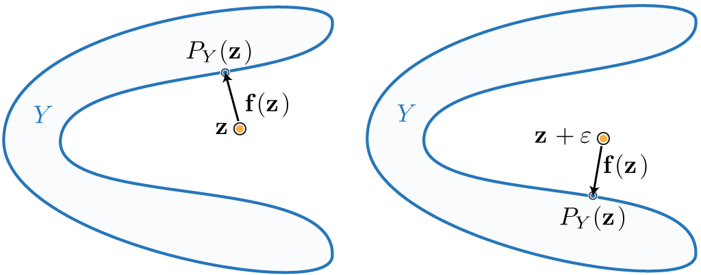

# Geometry Processing – Registration

> **To get started:** Clone this repository then issue
> 
>     git clone --recursive http://github.com/[username]/geometry-processing-registration.git
>

## Installation, Layout, and Compilation

See
[introduction](http://github.com/alecjacobson/geometry-processing-introduction).

## Execution

Once built, you can execute the assignment from inside the `build/` using 

    ./registration [path to mesh1.obj] [path to mesh2.obj]

## Background

In this assignment, we will be implementing a version of the [iterative closest
point (ICP)](https://en.wikipedia.org/wiki/Iterative_closest_point), not to be
confused with [Insane Clown Posse](https://en.wikipedia.org/wiki/Insane_Clown_Posse).

Rather than [registering multiple point
clouds](https://en.wikipedia.org/wiki/Point_set_registration), we will register
multiple triangle mesh surfaces. 

This _algorithm_ and its many [variants](papers/Effcient_Variants_of_ICP.pdf) has been used for quite some time to
align discrete shapes. One of the first descriptions is given in ["A Method for
Registration of 3-D Shapes" by Besl & McKay 1992](papers/method-for-registration-3d-shapes.pdf). However, the award-winning
PhD thesis of Sofien Bouaziz [("Realtime Face Tracking and Animation" 2015,
section 3.2-3.3)](https://lgg.epfl.ch/publications/2015/Sofien_Thesis/thesis.pdf) contains a more modern view that unifies many of the variants
with respect to how they impact the same core optimization problem. 

For our assignment, we will assume that we have a triangle mesh representing a
complete scan of the surface  of some [rigid
object](https://en.wikipedia.org/wiki/Rigid_body) and a new partial scan of
that surface .


These meshes will not have the same number of vertices or the even the same
topology. We will first explore different ways to _measure_ how well aligned
two surfaces are and then how to optimize the _rigid_ alignment of the partial
surface  to the complete surface .

## Hausdorff distance

We would like to compute a single scalar number that measures how poorly two
surfaces are matched. In other words, we would like to measure the _distance_
between two surfaces. Let's start by reviewing more familiar distances:

#### Point-to-point distance
The usually Euclidean distance between _two points_  and  is the 
norm of their difference :

<p align="center"></p>


#### Point-to-projection distance

When we consider the distance between a point  and some _larger_ object  (a line,
a circle, a surface), the natural extension is to take the distance to the
closest point  on :

<p align="center"></p>


written in this way the
[infimum](https://en.wikipedia.org/wiki/Infimum_and_supremum) considers all
possible points  and keeps the minimum distance. We may equivalently write
this distance instead as simply the point-to-point distance between  and
the _closest-point projection_ :

<p align="center"></p>


If  is a smooth surface, this projection will also be an [orthogonal
projection](https://en.wikipedia.org/wiki/Projection_(linear_algebra)#Orthogonal_projections).


### Directed Hausdorff distance

We might be tempted to define the distance from surface  to  as the
_infimum_ of _point-to-projection_ distances over all points  on :

<p align="center"></p>


but this will not be useful for registering two surfaces: it will measure zero
if even just a single point of  happens to lie on . Imagine the noses of
two faces touching at their tips.

Instead, we should take the _supremum_ of _point-to-projection_ distances over
all points  on :

<p align="center"></p>


This surface-to-surface distance measure is called the _directed_ [Hausdorff
distance](https://en.wikipedia.org/wiki/Hausdorff_distance). We may interpret
this as taking the worst of the best: we 
let each point  on  declare its shortest distance to  and then keep
the longest of those.


It is easy to verify that  will only equal zero if all
points on  also lie exactly on . 

The converse is not true: if  there may still be
points on  that do not lie on . In other words, _in general_ the directed
Hausdorff distance from surface  to surface  will not equal the Hausdorff
distance from surface  to surface :

<p align="center"></p>


#### directed Hausdorff distance between triangle meshes

We can approximate a _lower bound_ on the Hausdorff distance between two meshes
by densely sampling surfaces  and . We will discuss sampling methods,
later. For now consider that we have chosen a set  of  points on 
(each point might lie at a vertex, along an edge, or inside a triangle). The
directed Hausdorff distance from  to another triangle mesh  must be
_greater_ than the directed Hausdorff distance from this [point
cloud](https://en.wikipedia.org/wiki/Point_cloud)  to :

<p align="center"></p>


where we should be careful to ensure that the projection  of the
point  onto the triangle mesh  might lie at a vertex, along an edge or
inside a triangle. 

As our sampling  becomes denser and denser on  this lower bound will
approach the true directed Hausdorff distance. Unfortunately, an efficient
_upper bound_ is significantly more difficult to design.

#### Hausdorff distance for alignment optimization

Even if it _were_ cheap to compute, Hausdorff distance is difficult to
_optimize_ when aligning two surfaces. If we treat the Hausdorff distance
between surfaces  and  as an energy to be minimized, then only change to
the surfaces that will decrease the energy will be moving the (in general)
isolated point on  and isolated point on  generating the maximum-minimum
distance. In effect, the rest of the surface does not even matter or effect the
Hausdorff distance. This, or any type of  norm, will be much more
difficult to optimize.

Hausdorff distance can serve as a validation measure, while we turn to 
norms for optimization.

## Integrated closest-point distance

We would like a distance measure between two surfaces that---like Hausdorff
distance---does not require a shared parameterization. Unlike Hausdorff
distance, we would like this distance to _diffuse_ the measurement over the
entire surfaces rather than generate it from the sole _worst offender_. We can
accomplish this by replacing the _supremum_ in the Hausdorff distance ()
with a integral of squared distances (). Let us first define a directed
_closest-point distance_ from  a surface  to another surface , as the
integral of the squared distance from every point  on  to its
closest-point projection  on the surfaces :

<p align="center"></p>


This distance will only be zero if all points on  also lie on , but when
it is non-zero it is summing/averaging/diffusing the distance measures of all
of the points.

This distance is suitable to define a matching energy, but is not necessarily
welcoming for optimization: the function inside the square is non-linear. Let's
dig into it a bit. We'll define a directed _matching energy_
 from  to  to be the squared directed
closest point distance from  to :

<p align="center"></p>


where we introduce the proximity function  defined simply as the
vector from a point  to its closest-point projection onto :

<p align="center"></p>


Suppose  was not a surface, but just a single point . In this
case,  is clearly linear in .

Similarly, suppose  was an [infinite
plane](https://en.wikipedia.org/wiki/Plane_(geometry))  defined by some point  on the plane and the plane's unit normal vector
. Then  is also linear in .

But in general, if  is an interesting surface  will be non-linear; it
might not even be a continuous function.



In optimization, a common successful strategy to minimize energies composed of
squaring a non-linear functions  is to
[linearize](https://en.wikipedia.org/wiki/Linearization) the function about a
current input value (i.e., a current guess ), minimize the energy built
from this linearization, then re-linearize around that solution, and then
repeat. 

This is the core idea behind [gradient
descent](https://en.wikipedia.org/wiki/Gradient_descent) and the
[Gauss-Newton](https://en.wikipedia.org/wiki/Gauss–Newton_algorithm) methods:

```
minimize f(z)^{2}
  z_{0} \Leftarrow  initial guess
  repeat until convergence
    f_{0} \Leftarrow  linearize f(z) around z_{0}
    z_{0} \Leftarrow  minimize f_{0}(z)^{2}
```

Since our  is a geometric function, we can derive its linearizations
_geometrically_.

### Constant function approximation

If we make the convenient---however unrealistic---assumption that in the
neighborhood of the closest-point projection  of the current guess
 the surface  is simply the point  (perhaps imagine that 
is makes a sharp needle-like point at  or that  is very far away
from ), then we can approximate  in the proximity of our current
guess  as the vector between the input point  and :

<p align="center"></p>


In effect, we are assuming that the surface  is _constant_ function of its
parameterization: .

Minimizing  iteratively using this linearization (or
rather _constantization_) of  is equivalent to the [gradient
descent](https://en.wikipedia.org/wiki/Gradient_descent). We have simply
derived our gradients geometrically.

### Linear function approximation

If we make make a slightly more appropriate assumption that in the neighborhood
of the   the surface  is a plane, then we can improve this
approximation while keeping  linear in :

<p align="center"></p>


where the plane that _best_ approximates  locally near  is the
[tangent plane](https://en.wikipedia.org/wiki/Tangent_space) defined by the
[normal vector](https://en.wikipedia.org/wiki/Normal_(geometry))  at
.


Minimizing  iteratively using this linearization of
 is equivalent to the
[Gauss-Newton](https://en.wikipedia.org/wiki/Gauss–Newton_algorithm) method. We
have simply derived our linear approximation geometrically.

Equipped with these linearizations, we may now describe an [optimization
algorithm](https://en.wikipedia.org/wiki/Mathematical_optimization#Optimization_algorithms)
for minimizing the matching energy between a surface  and another surface
.

## Iterative closest point algorithm

So far we have derived distances between a surface  and another surface .
In our _rigid_ alignment and registration problem, we would like to
[transform](https://en.wikipedia.org/wiki/Transformation_(function)) one
surface  into a new surface  so that it best aligns with/matches
the other surface . Further we require that  is a rigid transformation:
 for some rotation matrix 
(i.e., an [orthogonal matrix with determinant
1](https://en.wikipedia.org/wiki/Rotation_group_SO(3))) and translation vector
.

Our matching problem can be written as an optimization problem to find the best
possible rotation  and translation  that match surface  to surface
:

<p align="center"></p>


Even if  is a triangle mesh, it is difficult to _integrate_ over _all_
points on the surface of . _At any point_, we can approximate this energy by
_summing_ over a point-sampling of :

<p align="center"></p>


where  is a set of  points on  so that each point 
might lie at a vertex, along an edge, or inside a triangle. We defer discussion
of _how_ to sample a triangle mesh surface.

### Pseudocode

As the name implies, the method proceeds by iteratively finding the closest
point on  to the current rigid transformation  of each sample
point  in  and then minimizing the _linearized_ energy to update the
rotation  and translation . 

If  and  are the vertices and faces of a triangle mesh surface 
(and correspondingly for ), then we can summarize a generic ICP algorithm in
pseudocode:

```
icp V_X, F_X, V_Y, F_Y
  R,t \Leftarrow  initialize (e.g., set to identity transformation)
  repeat until convergence
    X \Leftarrow  sample source mesh (V_X,F_X)
    P0 \Leftarrow  project all X onto target mesh (V_Y,F_Y)
    R,t \Leftarrow  update rigid transform to best match X and P0
    V_X \Leftarrow  rigidly transform original source mesh by R and t
```

### Updating the rigid transformation

We would like to find the rotation matrix  and
translation vector  that _best_ aligns a given a set of points  on the source mesh and their current closest points 
on the target mesh. We have two choices for _linearizing_ our matching energy:
point-to-point (gradient descent) and point-to-plane (Gauss-Newton).


In either case, this is still a non-linear optimization problem. This time due
to the [constraints](https://en.wikipedia.org/wiki/Constrained_optimization)
rather than the energy term. 

We require that  is not just any 3\times 3 matrix, but a rotation matrix. We
can _linearize_ this constraint, by assuming that the rotation in  will
be very small and thus well approximated by the identity matrix  plus a
skew-symmetric matrix:

<p align="center"></p>


where we can now work directly with the three scalar unknowns ,  and .

### Approximate point-to-point minimizer

If we apply our linearization of  to the **point-to-point** distance
linearization of the matching energy, our minimization becomes:

<p align="center"></p>


This energy is quadratic in the translation vector  and the linearized
rotation angles ,  and . Let's gather these degrees of freedom into a
vector of unknowns: . Then we can write our
problem in summation form as:

<p align="center"></p>


This can be written compactly in matrix form as:

<p align="center"></p>

where we introduce the matrix  that gathers the columns
 of  and columns of ones .

This quadratic energy is minimized with its partial derivatives with respect to
entries in  are all zero:

<p align="center"></p>


Solving this small 6\times 6 system gives us our translation vector  and the
linearized rotation angles ,  and . If we simply assign 

<p align="center"></p>


then our transformation will _not_ be rigid. Instead, we should project 
onto the space of rotation matrices.

#### Recovering a pure rotation from its linearization

> In an effort to provide an alternative from "Least-Squares Rigid Motion Using
> SVD" [Sorkine 2009], this derivation purposefully _avoids_ the [trace
> operator](https://en.wikipedia.org/wiki/Trace_(linear_algebra)) and its
> various nice properties.

If ,  and  are all small, then it may be safe to _interpret_ these
values as rotation angles about the , , and  axes respectively.

In general, it is better to find the closest rotation matrix to . In other
words, we'd like to solve the small optimization problem:

<p align="center"></p>

where  computes the squared [Frobenius
norm](https://en.wikipedia.org/wiki/Matrix_norm#Frobenius_norm) of the matrix
 (i.e., the sum of all squared element values. In MATLAB syntax:
`sum(sum(A.^2))`). We can expand the norm by taking advantage of the [associativity
property](https://en.wikipedia.org/wiki/Associative_property) of the Frobenius
norm:
<p align="center"></p>

where  is the
[Frobenius inner
product](https://en.wikipedia.org/wiki/Frobenius_inner_product) of   and
 (i.e., the sum of all per-element products. In MATLAB syntax:
`sum(sum(A.*B))`). We can drop the Frobenius norm
of  term () because it is constant with respect to the unknown rotation
matrix . We can also drop the Frobenius norm of  term because it
must equal one () since  is required to be a orthonormal matrix
(). We can drop the factor of  and flip the minus sign to
change our _minimization_ problem into a _maximization_ problem:
<p align="center"></p>


We now take advantage of the [singular value
decomposition](https://en.wikipedia.org/wiki/Singular_value_decomposition) of
, where  are orthonormal matrices
and  is a non-negative diagonal matrix:

<p align="center"></p>


The Frobenius inner product will let us move the products by  and  from
the right argument to the left argument:

> Recall some linear algebra properties:
> 
>  1. Matrix multiplication (on the left) can be understood as _acting_ on each
>    column: ,
>  4. The [Kronecker product](https://en.wikipedia.org/wiki/Kronecker_product)
>     of the identity matrix  of size  and a matrix  simply
>    repeats  along the diagonal k times. In MATLAB, `repdiag(A,k)`,
>  3. Properties 1. and 2. imply that the vectorization of a matrix product
>     can be written as the Kronecker product of the #-columns-in-
>    identity matrix and  times the vectorization of :
>    ,
>  4. The transpose of a Kronecker product is the Kronecker product of
>    transposes: ,
>  5. The Frobenius inner product can be written as a [dot
>    product](://en.wikipedia.org/wiki/Dot_product) of
>    [vectorized](https://en.wikipedia.org/wiki/Vectorization_(mathematics))
>    matrices: ,
>  6. Properties 3., 4., and 5. imply that Frobenius inner product of a matrix
>     and the matrix product of matrix  and  is equal to the
>    Frobenius inner product of the matrix product of the transpose of  and
>      and the matrix :
>    .
>  

<p align="center"></p>


Now,  and  are both
[orthonormal](https://en.wikipedia.org/wiki/Orthogonal_matrix), so multiplying
them against a rotation matrix  does not change its orthonormality. We can
pull them out of the maximization if we account for the reflection they _might_
incur: introduce  with .
This implies that the optimal rotation for the original probklem is recovered
via .  When we move the  inside, we now
look for an orthonormal matrix  that is a reflection (if
) or a rotation (if ):

<p align="center"></p>


This ensures that as a result  will be a rotation: .

> Recall that  is a non-negative diagonal matrix of singular values
> sorted so that the smallest value is in the bottom right corner.

Because  is orthonormal, each column (or row) of  must have unit norm.
Placing a non-zero on the off-diagonal will get "killed" when multiplied by the
corresponding zero in . So the optimal choice of  is to set all values to
zero except on the diagonal. If , then we should set
one (and only one) of these values to . The best choice is the bottom right
corner since that will multiply against the smallest singular value in  (add
negatively affect the maximization the least):

<p align="center"></p>


Finally, we have a formula for our optimal rotation:

<p align="center"></p>


> ### Closed-form point-to-point minimizer
>
> 
> _Interestingly_, despite the non-linear constraint on  there is actually
> a closed-form solution to the point-to-point matching problem:
> 
> <p align="center"></p>

> 
> This is a variant of what's known as a [Procrustes
> problem](https://en.wikipedia.org/wiki/Orthogonal_Procrustes_problem), named
> after a [mythical psychopath](https://en.wikipedia.org/wiki/Procrustes) who
> would kidnap people and force them to fit in his bed by stretching them or
> cutting off their legs. In our case, we are forcing  to be perfectly
> orthogonal (no "longer", no "shorter).
> 
> #### Substituting out the translation terms
> 
> This energy is _quadratic_ in  and there are no other constraints on
> . We can immediately solve for the optimal ---leaving  as an unknown---by
> setting all derivatives with respect to unknowns in  to zero:
> 
> <p align="center"></p>

> where  is a vector ones. Setting the partial derivative with
> respect to  of this
> quadratic energy to zero finds the minimum:
> <p align="center"></p>

> 
> Rearranging terms above reveals that the optimal  is the vector aligning
> the [centroids](https://en.wikipedia.org/wiki/Centroid) of the points in 
> and the points in  rotated by the---yet-unknown---. Introducing
> variables for the respective centroids  and , we can write the
> formula for the optimal  :
> 
> <p align="center"></p>

> 
> Now we have a formula for the optimal translation vector  in terms of the
> unknown rotation . Let us
> [substitute](https://en.wikipedia.org/wiki/Substitution_(algebra)) this formula
> for all occurrences of  in our energy written in its original summation
> form:
> 
> <p align="center"></p>

> 
> where we introduce  where the ith row contains the
> _relative position_ of the ith point to the centroid : i.e.,
>  (and analagously for ).
> 
> Now we have the canonical form of the [orthogonal procrustes
> problem](https://en.wikipedia.org/wiki/Orthogonal_Procrustes_problem). To
> find the optimal rotation matrix  we will massage the terms in the
> _minimization_ until we have a _maximization_ problem involving the [Frobenius
> inner-product](https://en.wikipedia.org/wiki/Frobenius_inner_product) of the
> unknown rotation  and [covariance
> matrix](https://en.wikipedia.org/wiki/Covariance_matrix) of  and :
> 
> <p align="center"></p>

> 
> Letting  we can now follow the
> steps above using [singular value
> decomposition](https://en.wikipedia.org/wiki/Singular_value_decomposition) to
> find the optimal .

### Approximate point-to-plane minimizer

If we apply our linearization of  to the **point-to-plane** distance
linearization of the matching energy, our minimization is:

<p align="center"></p>


We can follow similar steps as above. Let's gather a vector of unknowns: . Then we can write our problem in summation form
as:

<p align="center"></p>


This can be written compactly in matrix form as:

<p align="center"></p>


where  is the ith column from the matrix of normals ,
 [creates a diagonal
matrix](https://en.wikipedia.org/wiki/Diagonal_matrix#Matrix_operations) from a
vector, and  is the same as above.

This energy is quadratic in  and can be solve by setting all partial
derivatives with respect to  to zero.

> ### Closed-form point-to-point minimizer
>
> To the best of my knowledge, no known closed-form solution exists. I am not
> sure whether it **_can not_** exist or just whether no one has figured it out
> (or they did and I just do not know about it).

## Uniform random sampling of a triangle mesh

Our last missing piece is to sample the surface of a triangle mesh  with 
faces uniformly randomly. This allows us to approximate _continuous_ integrals
over the surface  with a summation of the integrand evaluated at a finite
number of randomly selected points. This type of [numerical
integration](https://en.wikipedia.org/wiki/Numerical_integration) is called the
[Monte Carlo method](https://en.wikipedia.org/wiki/Monte_Carlo_method).

We would like our [random
variable](https://en.wikipedia.org/wiki/Random_variable)  to have a
uniform [probability density
function](https://en.wikipedia.org/wiki/Probability_density_function) , where  is the [surface
area](https://en.wikipedia.org/wiki/Surface_area) of the triangle mesh . We
can achieve this by breaking the problem into two steps: uniformly sampling in
a single triangle and sampling triangles non-uniformly according to their
area.

Suppose we have a way to evaluate a continuous random point  in a triangle
 with uniform probability density function  _and_ we have a
away to evaluate a discrete random triangle index  with [discrete
probability
distribution](https://en.wikipedia.org/wiki/Probability_distribution#Discrete_probability_distribution)
, then the joint probability of evaluating a certain triangle
index  and then uniformly random point in that triangle  is indeed
uniform over the surface:

<p align="center"></p>


### Uniform random sampling of a single triangle

In order to pick a point uniformly randomly in a triangle with corners  we will _first_ pick a point uniformly randomly in the
[parallelogram](https://en.wikipedia.org/wiki/Parallelogram) formed by
reflecting  across the line :

<p align="center"></p>


where  are uniformly sampled from the unit interval . If 
then the point  above will lie in the reflected triangle rather than the
original one. In this case, preprocess  and  by setting  and
 to reflect the point  back into the original triangle.

### Area-weighted random sampling of triangles

Assuming we know how to draw a _continuous_ uniform random variable  from
the unit interval , we would now like to draw a _discrete_ random
triangle index  from the sequence  with likelihood proportional to
the relative area of each triangle in the mesh.

We can achieve this by first computing the [cumulative
sum](https://en.wikipedia.org/wiki/Running_total)  of the relative
areas:

<p align="center"></p>


Then our random index is found by identifying the first entry in  whose
value is greater than a uniform random variable . Since  is sorted,
locating this entry can be done in 
[time](https://en.wikipedia.org/wiki/Big_O_notation).

### Why is my code so slow?

Try profiling your code. Where is most of the computation time spent?

If you have done things right, the majority of time is spent computing
point-to-mesh distances. For each query point, the [computational
complexity](https://en.wikipedia.org/wiki/Computational_complexity_theory) of
computing its distance to a mesh with  faces is .

This can be _dramatically_ improved (e.g., to  on average) using an
[space partitioning](https://en.wikipedia.org/wiki/Space_partitioning) data
structure such as a [kd tree](https://en.wikipedia.org/wiki/K-d_tree), a
[bounding volume
hierarchy](https://en.wikipedia.org/wiki/Bounding_volume_hierarchy), or
[spatial hash](https://en.wikipedia.org/wiki/Bin_(computational_geometry)).

## Tasks

### Read \[Bouaziz 2015\]

This reading task is not directly graded, but it's expected that you read and
understand sections 3.2-3.3 of Sofien Bouaziz's PhD thesis "Realtime Face
Tracking and Animation" 2015. _Understanding_ this may require digging into
wikipedia, other online resources or other papers.

### Blacklist

You may not use the following libigl functions:

- `igl::AABB`
- `igl::fit_rotations`
- `igl::hausdorff`
- `igl::iterative_closest_point`
- `igl::point_mesh_squared_distance`
- `igl::point_simplex_squared_distance`
- `igl::polar_dec`
- `igl::polar_svd3x3`
- `igl::polar_svd`
- `igl::random_points_on_mesh`
- `igl::rigid_alignment`

### Whitelist

You are encouraged to use the following libigl functions:

- `igl::cumsum` computes cumulative sum
- `igl::doublearea` computes triangle areas
- `igl::per_face_normals` computes normal vectors for each triangle face

### `src/random_points_on_mesh.cpp`

Generate `n` random points uniformly sampled _on_ a given triangle mesh with
vertex positions `VX` and face indices `FX`. 

### `src/point_triangle_distance.cpp`
Compute the distance `d` between a given point `x` and the closest point `p` on
a given triangle with corners `a`, `b`, and `c`.

### `src/point_mesh_distance.cpp`
Compute the distances `D` between a set of given points `X` and their closest
points `P` on a given mesh with vertex positions `VY` and face indices `FY`.
For each point in `P` also output a corresponding normal in `N`.

> It is OK to assume that all points in `P` lie inside (rather than exactly at
> vertices or exactly along edges) for the purposes of normal computation in
> `N`.

### `src/hausdorff_lower_bound.cpp`
Compute a lower bound on the _directed_ Hausdorff distance from a given mesh
(`VX`,`FX`) to another mesh (`VY`,`FY`). This function should be implemented by
randomly sampling the  mesh.

### `src/closest_rotation.cpp`
Given a 3\times 3 matrix `M`, find the closest rotation matrix `R`.

### `src/point_to_point_rigid_matching.cpp`
Given a set of source points X and corresponding target points P, find the
optimal rigid transformation (R,t) that aligns X to P, minimizing the
point-to-point matching energy.

You may implement either that "Approximate" solution via linearizing the
rotation matrix or the "closed form" solution

### `src/point_to_plane_rigid_matching.cpp`
Given a set of source points `X` and corresponding target points `P` and their
normals `N`, find the optimal rigid transformation (`R`,`t`) that aligns `X` to
planes passing through `P` orthogonal to `N`, minimizing the point-to-point
matching energy.

### `src/icp_single_iteration.cpp`
Conduct a _single iteration_ of the iterative closest point method align
(`VX`,`FX`) to (`VY`,`FY`) by finding the rigid transformation (`R`,`t`)
minimizing the matching energy.

The caller can specify the number of samples `num_samples` used to approximate
the integral over  and specify the `method` (point-to-point or
point-to-plane).
