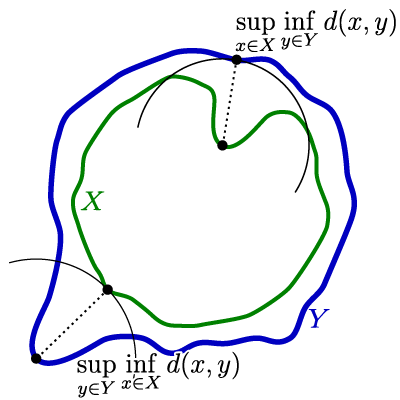

# Geometry Processing – Registration

> **To get started:** Fork this repository then issue
> 
>     git clone --recursive http://github.com/[username]/geometry-processing-registration.git
>

## Installation, Layout, and Compilation

See
[introduction](http://github.com/alecjacobson/geometry-processing-introduction).

## Execution

Once built, you can execute the assignment from inside the `build/` using 

    ./mesh-reconstruction [path to mesh1.obj] [path to mesh2.obj] ...

## Background

In this assignment, we will be implementing a version of the [iterative closest
point (ICP)](https://en.wikipedia.org/wiki/Iterative_closest_point), not to be
confused with [Insane Clown Posse](https://en.wikipedia.org/wiki/Insane_Clown_Posse).

This _algorithm_ and its many variants has been use for quite some time to
align discrete shapes. One of the first descriptions is given in "A Method for
Registration of 3-D Shapes" by Besl & McKay 1992. However, the award-winning
PhD thesis of Sofien Bouaziz ("Realtime Face Tracking and Animation" 2015,
section 3.2-3.3) contains a more modern view that unifies many of the variants
with respect to how they impact the same core optimization problem. 

Our goal is to _align_ shape $Z$ to shape $Y$. For now, let's assume that $Z$
and $Y$ are smooth surfaces. We will revisit this assumption later, and
investigate how things change if $Z$ and $Y$ are actually point clouds or
triangle meshes.

There are various ways to measure how well aligned two surfaces are. 

### Matching surfaces that share a parameterization

For example, consider if a surface $X$ is given with a parameterization so that
each point on $X$ can be written as a function of parameters $u$ and $v$,
$\x(u,v) ∈ X$. If $Y$ is another surface produced by the same parameterization
($\y(u,v) ∈ Y$), then we can think of $Y$ as a _deformation_ of $X$ (or
vice-versa). Each point $\y(u,v)$ on the surface $Y$ has a natural
corresponding point $\x(u,v)$ on $X$ via the parameters $u$ and $v$.

](images/beetle-deformation.png)

A very natural way to _measure_ the difference between these two surfaces
_aggregate_ the distance between each pair of corresponding points. For
example, we could [integrate](https://en.wikipedia.org/wiki/Integral) this
distance over the parametric domain
([w.l.o.g.](https://en.wikipedia.org/wiki/Without_loss_of_generality) let's say
valid values are $u,v ∈ (0,1)$):

\\[
D_2(X,Y) = \sqrt{ ∫_0^1∫_0^1 ‖\x(u,v) - \y(u,v)‖² \;du\;dv }
\\]

This measure will be zero if the surfaces are the same for any choice of
parameters $u$ and $v$. The measure $D_2(X,Y)$ could large if every point on
$Y$ is _slightly_ deformed or if a few bad points are deformed a lot. This
distance is the [L²
norm](https://en.wikipedia.org/wiki/Norm_(mathematics)#Infinite-dimensional_case)
of the magnitude of the _displacement_ from $X$ to $Y$ (or vice-versa):

\\[
D_2(X,Y) = \sqrt{ ∫_0^1∫_0^1 d(u,v)² \;du\;dv }, \quad \text{ and } \quad d(u,v) = ‖\x(u,v) -
\y(u,v)‖
\\]

We can directly measure the _maximum_ distance between corresponding
points, the $L^∞$ norm:

\\[
D_∞(X,Y) = \lim_{p→∞} \sqrt[p]{∫_0^1∫_0^1 d(u,v)^p \;du\;dv } = \sup\limits_{u,v ∈
(0,1)} ‖\x(u,v) - \y(u,v)‖,
\\]

where $\sup$ takes the
[supremum](https://en.wikipedia.org/wiki/Infimum_and_supremum) (roughly the continuous math
analog of the [maximum](https://en.wikipedia.org/wiki/Maxima_and_minima)).

The measure $D_∞$ will also be exactly zero if the surfaces are the same.

#### Triangle meshes

On the computer, we can store an explicit surface as a triangle mesh. Triangle
meshes have an _implicit_ parameterization: each triangle can be trivially
and independently mapped to the unit triangle, via its [barycentric
coordinates](https://en.wikipedia.org/wiki/Barycentric_coordinate_system#Barycentric_coordinates_on_triangles).

Triangle meshes also afford an immediate analog of deformation: moving each
vertex of the mesh (without change the mesh combinatorics/topology).

So if $\V_X ∈ \R^{n × 3}$ represents the vertices of our surface $X$ with $m$
triangular faces and  $\V_Y ∈ \R^{n × 3}$ the vertices of deformed surface $Y$,
then we can rewrite our measure $D_2$ above as a sum of integrals over each
triangle:

\\[
∑\limits_{t = 1}^m  \sqrt{ ∫_0^u ∫_0^1 ‖\x(u,v) - \y(u,v)‖² \;du\;dv }
\\]

> **Note:** The _areas_ of the triangles in our mesh may be different. So this
> measure may be thrown off by a very large triangle with a small difference
> and may fail to measure a very small triangle with a large difference. We'll
> learn how to account for this, later.

Unfortunately, in many scenarios we do not have two co-parameterized surface or
a simple per-vertex mesh deformation. Instead, we may have two arbitrary
surfaces discretized with different meshes of different
topologies. We will need a measure of difference or distance between two
surfaces that does not assume a shared parameterization.

## Hausdorff distance

We can build a distance measure between two surfaces out of two ingredients:

 1. the distance between a single point to a surface, and 
 2. the supremum we used in $D_∞$ above.

#### Point-to-point distance
The usually Euclidean distance between _two points_ $\x$ and $\y$ is the $L²$
norm of their difference :

\\[
d(\x,\y) = ‖\x - \y‖.
\\]

#### Point-to-projection distance

When we consider the distance between a point $\x$ and some _larger_ object $Y$ (a line,
a circle, a surface), the natural extension is to take the distance to the
closest point $\y$ on $Y$:

\\[
d(\x,Y) = \inf_{\y ∈ Y} d(\x,\y).
\\]

written in this way the
[infimum](https://en.wikipedia.org/wiki/Infimum_and_supremum) considers all
possible points $\y$ and keeps the minimum distance. We may equivalently write
this distance instead as simply the point-to-point distance between $\x$ and
the _closest-point projection_ $P_Y(\x)$:

\\[
d(\x,Y) = d((\x,P_Y(\x)) = ‖\x - P_Y(\x)‖.
\\]

If $Y$ is a smooth surface, this projection will also be an [orthogonal
projection](https://en.wikipedia.org/wiki/Projection_(linear_algebra)#Orthogonal_projections).

### Directed Hausdorff distance

We might be tempted to define the distance from surface $X$ to $Y$ as the
_infimum_ of _point-to-projection_ distances over all points $\x$ on $X$:

\\[
d_\text{inf}(X,Y) = \inf_{\x ∈ X} ‖\x - P_Y(\x)‖,
\\]

but this will not be useful for registering two surfaces: it will measure zero
if even just a single point of $\x$ happens to lie on $Y$. Imagine the noses of
two faces touching at their tips.

Instead, we should take the _supremum_ of _point-to-projection_ distances over
all points $\x$ on $X$:

\\[
d_{\overrightarrow{H}}(X,Y) = \sup_{\x ∈ X} ‖\x - P_Y(\x)‖.
\\]

This surface-to-surface distance measure is called the _directed_ [Hausdorff
distance](https://en.wikipedia.org/wiki/Hausdorff_distance). We may interpret
this as taking the worst of the best: we 
let each point $\x$ on $X$ declare its shortest distance to $Y$ and then keep
the longest of those.

It is easy to verify that $d_{\overrightarrow{H}}$ will only equal zero if all
points on $X$ also lie exactly on $Y$. 

The converse is not true: if $d_{\overrightarrow{H}}=0$ there may still be
points on $Y$ that do not lie on $X$. In other words, _in general_ the directed
Hausdorff distance from surface $X$ to surface $Y$ will not equal the Hausdorff
distance from surface $Y$ to surface $X$:

\\[
d_{\overrightarrow{H}}(X,Y) ≠ d_{\overrightarrow{H}}(Y,X).
\\]

### (undirected) Hausdorff distance

To form a [metric](https://en.wikipedia.org/wiki/Metric_(mathematics)) in the
mathematical sense, a distance measure should be symmetric: distance from $X$
to $Y$ equals distance from $Y$ to $X$. Hausdorff distance is defined as the
maximum of directed Haurdorff distances:

\\[
d_{H}(X,Y) = \max \left[ d_{\overrightarrow{H}}(X,Y)\ , \ d_{\overrightarrow{H}}(Y,X) \right].
\\]

Unlike each individual directed distance, the (undirected) Hausdorff distance
will measure zero [if and only
if](https://en.wikipedia.org/wiki/If_and_only_if) the [point
sets](https://en.wikipedia.org/wiki/Euclidean_space#Balls.2C_spheres.2C_and_hypersurfaces)
of the surface $X$ is identical to that of $Y$.

#### Triangle meshes

On the computer, surfaces represented with triangle meshes (like any point set)
admit a well-defined Hausdorff distance between one-another. Unfortunately,
computing _exact_ Hausdorff distance between two triangle meshes remains a
difficult task: known exact algorithm are prohibitively inefficient.

We do not know [_a
priori_](https://en.wikipedia.org/wiki/A_priori_and_a_posteriori) which
point(s) of each triangle mesh will end up determining the maximum value. It is
tempting, optimistic, but ultimately incorrect to assume that the _generator_
points will be one of the vertices of the triangle mesh. Consider if a triangle
$t$ connected corners at $(1,1,0)$, $(1,0,1)$ and $(0,1,1)$ and $B$ was a mesh
with two triangles, the first connecting $(0,0,0)$, $(1,0,1)$ and $(1,1,0)$ and
the second connecting $(0,0,0)$, $(0,1,1)$ and $(1,1,0)$. The corners of $t$
also appear as vertices of $B$, so clearly their respective vertex-to-mesh
distances are zero, yet the maximum minimum distance from $t$ to $B$ is clearly
non-zero (it is $\sqrt{3}/3$).

One might also optimistically, but erroneously hope that by considering the
symmetric Hausdorff distance one of the _generator_ points must lie on a vertex
of $A$ or of $B$. Unfortunately, this only follows for convex shapes.

We can approximate a _lower bound_ on the Hausdorff distance between two meshes
by densely sampling surfaces $X$ and $Y$. We will discuss sampling methods,
later. For now consider that we have chosen a set $\P_X$ of $k$ points on $X$
(each point might lie at a vertex, along an edge, or inside a triangle). The
directed Hausdorff distance from $X$ to another triangle mesh $Y$ must be
_greater_ than the directed Hausdorff distance from this [point
cloud](https://en.wikipedia.org/wiki/Point_cloud) $\P_X$ to $Y$:

\\[
d_{\overrightarrow{H}}(X,Y) ≥ 
d_{\overrightarrow{H}}(\P_X,Y) = \max_{i=1}^k ‖\p_i - P_Y(\p_i)‖,
\\]

where we should be careful to ensure that the projection $P_Y(\p_i)$ of the
point $\p_i$ onto the triangle mesh $Y$ might lie at a vertex, along an edge or
inside a triangle. 

As our sampling $\P_X$ becomes denser and denser on $X$ this lower bound will
approach the true directed Hausdorff distance. Unfortunately, an efficient
_upper bound_ is significantly more difficult to design.

#### Hausdorff distance for alignment optimization

Even if it _were_ cheap to compute, Hausdorff distance is difficult to
_optimize_ when aligning two surfaces. If we treat the Hausdorff distance
between surfaces $X$ and $Y$ as an energy to be minimized, then only change to
the surfaces that will decrease the energy will be moving the (in general)
isolated point on $X$ and isolated point on $Y$ generating the maximum-minimum
distance. In effect, the rest of the surface does not even matter or effect the
Hausdorff distance. This, or any type of $L^∞$ norm, will be much more
difficult to optimize.

Hausdorff distance can serve as a validation measure, while we turn to $L²$
norms for optimization.

## Average closest-point distance

## Iterative closest point algorithm

You're not "fixing" closest point, but rather linearizing around the current
configuration
### point to plane

### point to plane

### 

## Sampling meshes

### `Uniform random sampling on a triangle mesh`
### `point to triangle distance`
### `point to mesh distance`
### `Lower bound on Hausdorff distance between two meshes`

Rather
than [registering multiple point
clouds](https://en.wikipedia.org/wiki/Point_set_registration), we will register
multiple triangle mesh surfaces. 

- how well does _this_ surface match _that_ surface?
  - for partially overlapping surfaces, use this measure as "score" for
    alignment/registration
- abstract distance
  - distance between points 
  - difference between "rest shape" S and "deformed shape" f(S)
    - l2 norm
    - l1 norm
  - implicitly assumes matching parameterization
    - can write as integral over same (u,v)
- Hausdorff distance
  - mathematically elegant measure but infeasible matching energy?
    - Difficult to fool: hard to get very small Hausdorff while being poorly
      aligned
  - perhaps too idealized
    - not robust to outliers/noise
    - hard to use for partial overlaps
- Integrated projection matching energy 
  - closest point projection onto triangle mesh
  - point to point error metric
  - point to plane error metric
- Rigid transformations: Procrustes
- uniform random sampling
- bounding volume hierarchies
  - give this for free?
- In practice life is not so rigid
  - allow non-rigid, need to regularize to tame subspace
